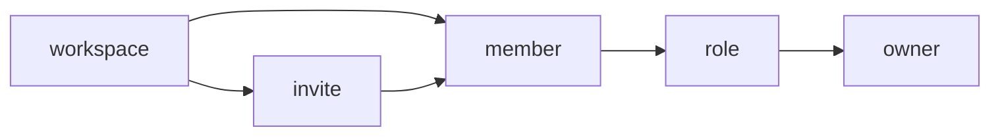

# Examples

## Example 1: Team collaboration feature vocabulary

**Input:**
- Feature: Team workspace management
- Scope: Creating, managing, and sharing team workspaces
- Existing terms: Engineering uses "org", design uses "team space", support uses "group"

**Output:**

```md
# Feature Vocabulary: Team Workspace Management

## Metadata
- **Feature:** Team workspace management
- **Version:** 1.0.0
- **Last updated:** 2026-02-20
- **Owner:** Content Design

## Overview
This vocabulary covers team-level organizational units where multiple users collaborate. It does not cover individual user accounts or enterprise-level administration.

## Vocabulary table

| Term | Definition | Usage context | Prohibited alternatives |
|------|------------|---------------|------------------------|
| workspace | A shared space where team members collaborate on projects | Settings, navigation, invitations | team space, org, organization, group, room |
| member | A person who belongs to a workspace | Member lists, permissions, invitations | user, teammate, colleague, participant |
| owner | The member with full administrative control of a workspace | Settings, permissions UI | admin, administrator, manager, creator |
| invite | The action of adding someone to a workspace | Buttons, confirmation messages | add, request, share access |
| role | A set of permissions assigned to a member | Settings, member management | permission level, access type, membership type |

## Detailed definitions

### workspace
- **Canonical form:** workspace (lowercase, one word)
- **Definition:** A shared space where team members collaborate on projects. Each workspace has its own members, settings, and content.
- **Usage context:** Navigation labels, settings pages, invitation flows, empty states
- **Prohibited alternatives:** team space, org, organization, group, room, area, hub
- **Rationale:** "Workspace" tested best in user research (7/10 immediate comprehension). "Team space" was ambiguous (physical vs. digital). "Org" is too technical.
- **Related terms:** member, owner, project

**Examples:**
- ✓ "Create a workspace"
- ✓ "Workspace settings"
- ✓ "You're now a member of Design Team workspace"
- ✗ "Create a team space"
- ✗ "Org settings"
- ✗ "Add to group"

---

### member
- **Canonical form:** member (lowercase)
- **Definition:** A person who belongs to a workspace and can access its content based on their role.
- **Usage context:** Member lists, permission settings, invitation confirmations
- **Prohibited alternatives:** user (too generic), teammate (assumes relationship), participant (too formal), colleague
- **Rationale:** "Member" is neutral and scales from small teams to large organizations without implying hierarchy.
- **Related terms:** workspace, role, owner

**Examples:**
- ✓ "3 members"
- ✓ "Invite members"
- ✓ "Member permissions"
- ✗ "3 users"
- ✗ "Invite teammates"
- ✗ "Participant list"

---

### owner
- **Canonical form:** owner (lowercase)
- **Definition:** The member with full administrative control of a workspace, including the ability to delete the workspace and manage all member roles.
- **Usage context:** Role labels, permission descriptions, transfer ownership flows
- **Prohibited alternatives:** admin, administrator (implies IT context), manager (implies hierarchy), creator (not always true after transfer)
- **Rationale:** "Owner" clearly conveys ultimate control and responsibility. Consistent with file sharing mental models.
- **Related terms:** member, role, workspace

**Examples:**
- ✓ "Workspace owner"
- ✓ "Transfer ownership"
- ✓ "Only the owner can delete this workspace"
- ✗ "Workspace admin"
- ✗ "Administrator settings"

---

### invite
- **Canonical form:** invite (verb), invitation (noun)
- **Definition:** The action of requesting someone to join a workspace as a member.
- **Usage context:** Buttons, success messages, pending states
- **Prohibited alternatives:** add (implies immediate action without consent), request (too formal), share access (ambiguous)
- **Rationale:** "Invite" implies the recipient has agency to accept or decline, which matches the actual flow.
- **Related terms:** member, workspace

**Examples:**
- ✓ "Invite to workspace"
- ✓ "Invitation sent"
- ✓ "Pending invitations"
- ✗ "Add to workspace" (for people)
- ✗ "Request sent"

---

### role
- **Canonical form:** role (lowercase)
- **Definition:** A set of permissions that determines what a member can do within a workspace.
- **Usage context:** Member management, permission settings, role selection UI
- **Prohibited alternatives:** permission level, access type, membership type
- **Rationale:** "Role" is the industry standard term that users recognize from other collaboration tools.
- **Related terms:** member, owner

**Examples:**
- ✓ "Change role"
- ✓ "Role: Editor"
- ✓ "Roles and permissions"
- ✗ "Change permission level"
- ✗ "Access type: Editor"

---

## Term relationships



## Conflict log
| Term | Conflict source | Resolution | Date |
|------|-----------------|------------|------|
| workspace vs. org | Engineering codebase uses "org" | Keep "org" in code, use "workspace" in UI. Added code comment mapping. | 2026-02-15 |
| workspace vs. team space | Design specs used "team space" | Unified to "workspace" after user research. Design specs updated. | 2026-02-18 |

## Cross-feature alignment
| Adjacent feature | Shared term | Alignment status |
|------------------|-------------|------------------|
| User account | member | Aligned — same term, same meaning |
| File sharing | owner | Aligned — same concept of control |
| Project management | workspace | Aligned — projects exist within workspaces |

## Validation checklist
- [x] All core concepts have defined terminology
- [x] No term is used for multiple concepts
- [x] No concept has multiple terms
- [x] Prohibited alternatives listed for each term
- [x] Terms checked against platform conventions
- [x] Terms checked against adjacent features
- [x] User-facing terms validated against user mental models
```

---

## Example 2: Edge case — resolving conflicting mental models

**Input:**
- Feature: Notification preferences
- Conflict: Users think "mute" means "block," but product needs to distinguish temporary silence from permanent blocking

**Output:**

```md
# Vocabulary Proposal: Pause Notifications

**Feature:** Notification preferences
**Proposed by:** Content Design
**Date:** 2026-02-20

## Context
User research (UR-2026-02-notif, n=10) revealed that 8/10 users interpreted "mute" as blocking the sender entirely. However, the feature only silences notifications temporarily—the sender can still message, and messages still appear in the inbox.

Current UI uses "Mute conversation" which leads to:
- Support tickets asking "Why can they still message me?"
- Users expecting "unmute" to reveal previously hidden messages
- Confusion between notification preferences and blocking

## Proposal
- **Term:** pause notifications
- **Definition:** Temporarily stop receiving notifications from a conversation. Messages still arrive and appear in your inbox; you just won't be notified about them.
- **Prohibited alternatives:** mute, silence, snooze (implies time limit), turn off notifications (too long)

## Rationale
"Pause" accurately conveys:
1. Temporary nature (you can unpause)
2. Only affects notifications (not message delivery)
3. User-controlled (not automatic)

"Notifications" makes the scope explicit—this affects alerts, not the messages themselves.

## Alternatives considered
| Alternative | Pros | Cons | Reason rejected |
|-------------|------|------|-----------------|
| Mute | Familiar from other apps | Tested poorly; implies blocking | User confusion documented |
| Silence | Clear meaning | Less common in UI patterns | Not standard platform term |
| Snooze | Implies temporary | Suggests automatic time limit | Feature has no auto-resume |
| Turn off notifications | Very explicit | Too long for button label | Verbosity |

## Impact assessment
- **UI strings affected:** 4 (mute button, unmute button, muted indicator, settings label)
- **Documentation affected:** 2 help articles
- **Code/API affected:** No — internal API can keep "mute" term

## Stakeholder input
| Stakeholder | Position | Notes |
|-------------|----------|-------|
| Product | Approve | Agrees user confusion is a problem |
| Engineering | Neutral | No code changes required |
| Support | Approve | "This will reduce tickets" |
| Localization | Concern | "Pause" may not translate directly | Addressed: provided translation guidance |

---

# Feature Vocabulary Update: Notification Preferences

**Version:** 1.2.0 → 1.3.0
**Date:** 2026-02-20

## Changes

### Modified
| Term | Before | After | Rationale |
|------|--------|-------|-----------|
| mute | Mute: Stop notifications from a conversation | pause notifications: Temporarily stop receiving notifications from a conversation | User research showed "mute" implies blocking |

### Deprecated
| Term | Replacement | Migration deadline |
|------|-------------|-------------------|
| mute | pause notifications | 2026-04-01 |
| unmute | resume notifications | 2026-04-01 |

## Validation checklist
- [x] All core concepts have defined terminology
- [x] No term is used for multiple concepts
- [x] No concept has multiple terms
- [x] Prohibited alternatives listed for each term
- [x] Terms checked against platform conventions
- [x] Terms checked against adjacent features
- [x] User-facing terms validated against user mental models
```
