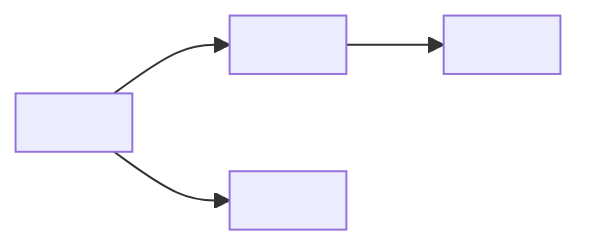

# Templates

## Default output: Feature vocabulary document

```md
# Feature Vocabulary: <Feature Name>

## Metadata
- **Feature:** <name>
- **Version:** <x.y.z>
- **Last updated:** <YYYY-MM-DD>
- **Owner:** <content design / product>

## Overview
<1-2 sentences describing the feature scope and vocabulary boundaries>

## Vocabulary table

| Term | Definition | Usage context | Prohibited alternatives |
|------|------------|---------------|------------------------|
| <canonical term> | <precise definition> | <where/when to use> | <terms NOT to use> |

## Detailed definitions

### <Term 1>
- **Canonical form:** <exact term to use>
- **Definition:** <what it means in this feature's context>
- **Usage context:** <UI locations, content types where this term appears>
- **Prohibited alternatives:** <list of terms to avoid>
- **Rationale:** <why this term was chosen, if non-obvious>
- **Related terms:** <other vocabulary items this connects to>

**Examples:**
- ✓ "<correct usage example>"
- ✗ "<incorrect usage example>"

---

### <Term 2>
<repeat structure>

---

## Term relationships



## Conflict log
| Term | Conflict source | Resolution | Date |
|------|-----------------|------------|------|
| <term> | <where conflict was> | <how resolved> | <YYYY-MM-DD> |

## Cross-feature alignment
| Adjacent feature | Shared term | Alignment status |
|------------------|-------------|------------------|
| <feature name> | <term> | <aligned / divergent + rationale> |

## Validation checklist
- [ ] All core concepts have defined terminology
- [ ] No term is used for multiple concepts
- [ ] No concept has multiple terms
- [ ] Prohibited alternatives listed for each term
- [ ] Terms checked against platform conventions
- [ ] Terms checked against adjacent features
- [ ] User-facing terms validated against user mental models
```

## Compact vocabulary list (for quick reference)

```md
# Vocabulary Quick Reference: <Feature Name>

| Concept | Use this | Not this |
|---------|----------|----------|
| <concept> | <canonical term> | <prohibited terms> |
```

## Vocabulary diff (for updates)

```md
# Vocabulary Update: <Feature Name>

**Version:** <old> → <new>
**Date:** <YYYY-MM-DD>

## Changes

### Added
| Term | Definition |
|------|------------|
| <new term> | <definition> |

### Modified
| Term | Before | After | Rationale |
|------|--------|-------|-----------|
| <term> | <old def> | <new def> | <why changed> |

### Deprecated
| Term | Replacement | Migration deadline |
|------|-------------|-------------------|
| <old term> | <new term> | <YYYY-MM-DD> |
```

## Vocabulary proposal (for review)

```md
# Vocabulary Proposal: <Term>

**Feature:** <feature name>
**Proposed by:** <name>
**Date:** <YYYY-MM-DD>

## Context
<Why this term needs to be defined or changed>

## Proposal
- **Term:** <proposed canonical form>
- **Definition:** <proposed definition>
- **Prohibited alternatives:** <what to avoid>

## Rationale
<Why this term over alternatives>

## Alternatives considered
| Alternative | Pros | Cons | Reason rejected |
|-------------|------|------|-----------------|
| <term> | <pros> | <cons> | <why not chosen> |

## Impact assessment
- **UI strings affected:** <count or list>
- **Documentation affected:** <count or list>
- **Code/API affected:** <yes/no + scope>

## Stakeholder input
| Stakeholder | Position | Notes |
|-------------|----------|-------|
| <role> | <approve/concern/reject> | <feedback> |
```
