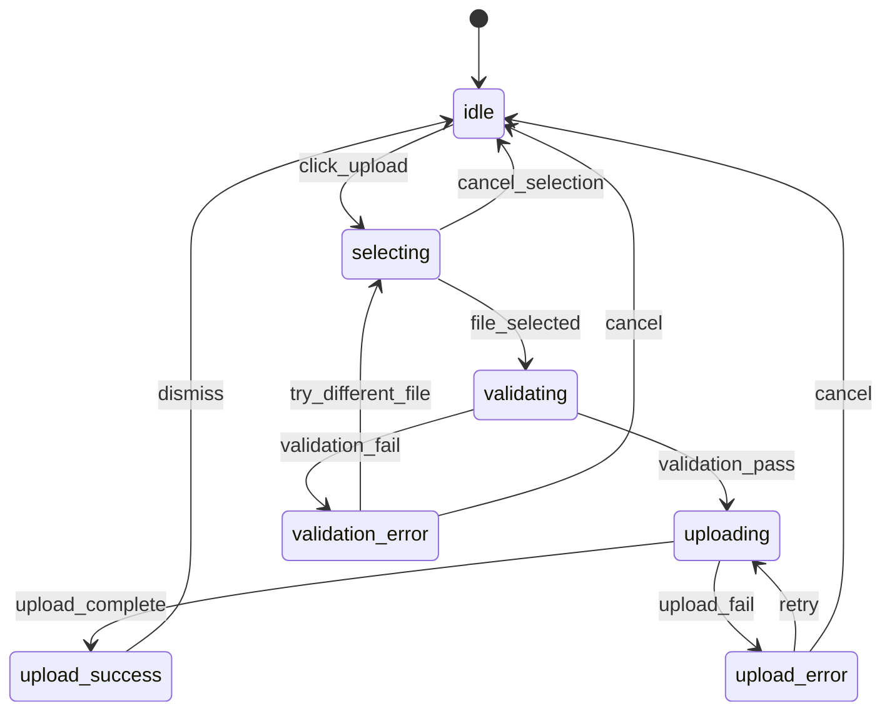
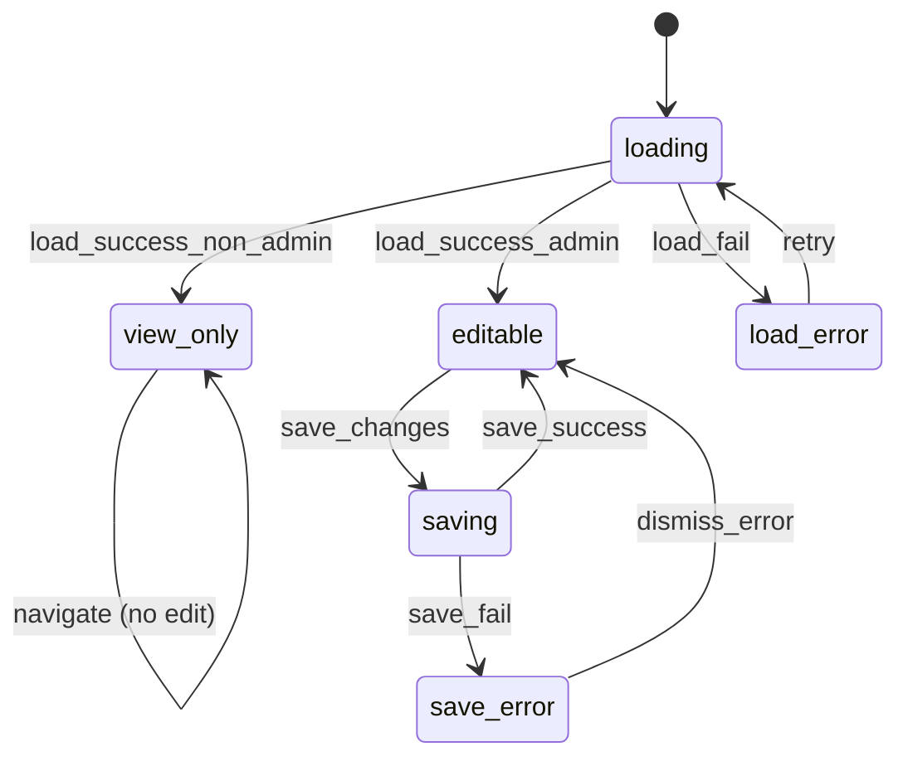

# Examples

## Example 1: File upload feature

**Input:**
- Feature: File upload in document editor
- Scope: From user initiating upload to file available in document

**Output:**

```md
# State Map: File Upload

## Overview
- **Feature:** File upload
- **Scope:** User-initiated file upload to document attachment
- **Entry state:** idle
- **Terminal states:** none (cycles back to idle)
- **Total states:** 7

## State diagram



## States

### idle
- **Type:** standard
- **Description:** No upload in progress. Upload button visible.
- **Entry triggers:** Initial load, upload complete, user cancels
- **Exit transitions:**
  - → selecting: user clicks upload button
- **Content requirements:**
  - Headline: none
  - Body: none
  - CTA: "Upload file"
- **User actions available:** Click upload button
- **System behaviors:** None

---

### selecting
- **Type:** standard
- **Description:** File picker is open. User browsing files.
- **Entry triggers:** User clicked upload button
- **Exit transitions:**
  - → validating: user selects a file
  - → idle: user cancels file picker
- **Content requirements:**
  - Headline: none (OS file picker)
  - Body: none
  - CTA: none (OS controls)
- **User actions available:** Select file, cancel
- **System behaviors:** OS file picker displayed

---

### validating
- **Type:** loading
- **Description:** System checking file type, size, and permissions.
- **Entry triggers:** File selected
- **Exit transitions:**
  - → uploading: validation passes
  - → validation_error: validation fails
- **Content requirements:**
  - Headline: none
  - Body: "Checking file..."
  - CTA: none (non-interruptible)
- **User actions available:** None (brief state)
- **System behaviors:** File validation in progress

---

### validation_error
- **Type:** error
- **Description:** File rejected due to type, size, or permission issue.
- **Entry triggers:** Validation failed
- **Exit transitions:**
  - → selecting: user tries different file
  - → idle: user cancels
- **Content requirements:**
  - Headline: "Can't upload this file"
  - Body: <specific reason: "File exceeds 25 MB limit" / "PDFs aren't supported" / etc.>
  - CTA: "Choose different file" (primary), "Cancel" (secondary)
  - Error message: Contextual to failure reason
- **User actions available:** Choose different file, cancel
- **System behaviors:** None

---

### uploading
- **Type:** loading
- **Description:** File transfer in progress.
- **Entry triggers:** Validation passed
- **Exit transitions:**
  - → upload_success: upload completes
  - → upload_error: upload fails
- **Content requirements:**
  - Headline: none
  - Body: "Uploading <filename>..."
  - CTA: "Cancel" (if cancellable)
  - Progress: percentage or indeterminate
- **User actions available:** Cancel (if supported)
- **System behaviors:** Progress updates, file transfer

---

### upload_success
- **Type:** success
- **Description:** File uploaded and attached to document.
- **Entry triggers:** Upload completed successfully
- **Exit transitions:**
  - → idle: user dismisses or auto-dismiss after delay
- **Content requirements:**
  - Headline: none
  - Body: "<filename> uploaded"
  - CTA: "Done" or auto-dismiss
- **User actions available:** Dismiss
- **System behaviors:** Auto-dismiss after 3 seconds (configurable)

---

### upload_error
- **Type:** error
- **Description:** Upload failed due to network or server issue.
- **Entry triggers:** Upload request failed
- **Exit transitions:**
  - → uploading: user retries
  - → idle: user cancels
- **Content requirements:**
  - Headline: "Upload failed"
  - Body: "Check your connection and try again."
  - CTA: "Retry" (primary), "Cancel" (secondary)
  - Error message: Network or server-specific if available
- **User actions available:** Retry, cancel
- **System behaviors:** None

---

## Edge cases
| Scenario | Expected state | Notes |
|----------|---------------|-------|
| User's session expires during upload | upload_error | Show "Session expired. Sign in and try again." |
| File deleted from source after selection | validation_error | Show "File not found. It may have been moved or deleted." |
| Disk quota exceeded | upload_error | Show "Storage full. Delete files or upgrade your plan." |
| Duplicate filename | validating → prompt | Show "A file with this name exists. Replace it?" |

## Validation checklist
- [x] All states have at least one inbound transition (except entry)
- [x] All states have defined exit transitions or are terminal
- [x] Error states are documented
- [x] Loading/pending states are documented
- [x] Permission-gated states are documented (N/A for this feature)
- [x] Content requirements specified per state
```

---

## Example 2: Edge case — permission-gated feature

**Input:**
- Feature: Team settings page
- Scope: Viewing and editing team configuration
- Constraint: Only admins can edit

**Output:**

```md
# State Map: Team Settings

## Overview
- **Feature:** Team settings
- **Scope:** View and edit team configuration
- **Entry state:** loading
- **Terminal states:** none
- **Total states:** 6

## State diagram



## States

### loading
- **Type:** loading
- **Description:** Fetching team settings and user permissions.
- **Entry triggers:** Page navigation, retry after error
- **Exit transitions:**
  - → view_only: load succeeds, user is not admin
  - → editable: load succeeds, user is admin
  - → load_error: load fails
- **Content requirements:**
  - Headline: "Team settings"
  - Body: loading skeleton
  - CTA: none
- **User actions available:** None
- **System behaviors:** Fetch settings and permissions

---

### view_only
- **Type:** permission
- **Description:** User can view settings but not edit. Non-admin role.
- **Entry triggers:** Load success with non-admin permissions
- **Exit transitions:**
  - → view_only: navigation within settings (no state change)
- **Content requirements:**
  - Headline: "Team settings"
  - Body: Settings displayed, inputs disabled
  - CTA: none (or "Contact admin to make changes")
  - Permission message: "Only team admins can edit these settings."
- **User actions available:** View only
- **System behaviors:** None

---

### editable
- **Type:** standard
- **Description:** User can view and edit settings. Admin role.
- **Entry triggers:** Load success with admin permissions, save success
- **Exit transitions:**
  - → saving: user saves changes
- **Content requirements:**
  - Headline: "Team settings"
  - Body: Settings displayed, inputs enabled
  - CTA: "Save changes" (disabled until changes made)
- **User actions available:** Edit fields, save
- **System behaviors:** Track unsaved changes

---

### saving
- **Type:** loading
- **Description:** Submitting settings changes.
- **Entry triggers:** User clicks save
- **Exit transitions:**
  - → editable: save succeeds
  - → save_error: save fails
- **Content requirements:**
  - Headline: "Team settings"
  - Body: Settings displayed, inputs disabled during save
  - CTA: "Saving..." (disabled)
- **User actions available:** None
- **System behaviors:** Submit changes

---

### load_error
- **Type:** error
- **Description:** Failed to load settings.
- **Entry triggers:** Load request failed
- **Exit transitions:**
  - → loading: user retries
- **Content requirements:**
  - Headline: "Couldn't load settings"
  - Body: "Check your connection and try again."
  - CTA: "Retry"
- **User actions available:** Retry
- **System behaviors:** None

---

### save_error
- **Type:** error
- **Description:** Failed to save settings changes.
- **Entry triggers:** Save request failed
- **Exit transitions:**
  - → editable: user dismisses error
- **Content requirements:**
  - Headline: none (inline error)
  - Body: "Couldn't save changes. Try again."
  - CTA: "Dismiss" (returns to editable with changes preserved)
- **User actions available:** Dismiss, retry save
- **System behaviors:** Preserve unsaved changes

---

## Edge cases
| Scenario | Expected state | Notes |
|----------|---------------|-------|
| User demoted from admin while on page | view_only | On next action, re-check permissions, transition to view_only |
| Concurrent edit by another admin | save_error | Show "Settings were changed by someone else. Refresh to see latest." |
| Network timeout during save | save_error | Preserve changes, allow retry |

## Validation checklist
- [x] All states have at least one inbound transition (except entry)
- [x] All states have defined exit transitions or are terminal
- [x] Error states are documented
- [x] Loading/pending states are documented
- [x] Permission-gated states are documented
- [x] Content requirements specified per state
```
