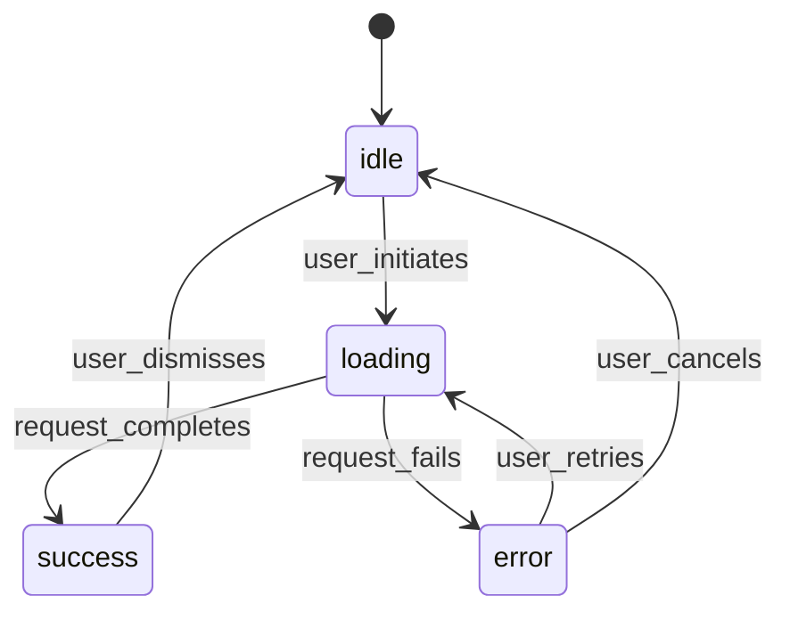

# Templates

## Default output: State map document

```md
# State Map: <Feature Name>

## Overview
- **Feature:** <name>
- **Scope:** <what this map covers>
- **Entry state:** <first state users encounter>
- **Terminal states:** <states with no outbound transitions>
- **Total states:** <count>

## State diagram

```mermaid
stateDiagram-v2
    [*] --> <entry_state>
    <state_1> --> <state_2>: <trigger>
    <state_2> --> <state_3>: <trigger>
    <state_3> --> [*]
```



## States

### <State name>
- **Type:** <standard / error / loading / empty / success / permission / edge>
- **Description:** <what this state represents>
- **Entry triggers:** <what causes arrival at this state>
- **Exit transitions:**
  - → <next_state>: <trigger>
  - → <other_state>: <trigger>
- **Content requirements:**
  - Headline: <required / optional / none>
  - Body: <required / optional / none>
  - CTA: <label and action>
  - Error message: <if applicable>
- **User actions available:** <list>
- **System behaviors:** <what happens automatically>

---

### <Next state>
<repeat structure>

---

## Edge cases
| Scenario | Expected state | Notes |
|----------|---------------|-------|
| <edge case 1> | <state> | <handling notes> |
| <edge case 2> | <state> | <handling notes> |

## Validation checklist
- [ ] All states have at least one inbound transition (except entry)
- [ ] All states have defined exit transitions or are terminal
- [ ] Error states are documented
- [ ] Loading/pending states are documented
- [ ] Permission-gated states are documented
- [ ] Content requirements specified per state
```

## Compact state table (for quick reference)

```md
# State Table: <Feature Name>

| State | Type | Entry trigger | Exit transitions | Primary CTA |
|-------|------|---------------|------------------|-------------|
| <state> | <type> | <trigger> | <state>: <trigger> | <CTA label> |
```

## Mermaid diagram only (for embedding)



## Transition matrix (for complex features)

```md
# Transition Matrix: <Feature Name>

|              | → idle | → loading | → success | → error | → [end] |
|--------------|--------|-----------|-----------|---------|---------|
| **idle**     | -      | ✓         | -         | -       | ✓       |
| **loading**  | -      | -         | ✓         | ✓       | -       |
| **success**  | ✓      | -         | -         | -       | ✓       |
| **error**    | ✓      | ✓         | -         | -       | -       |

Legend: ✓ = valid transition, - = not allowed
```
