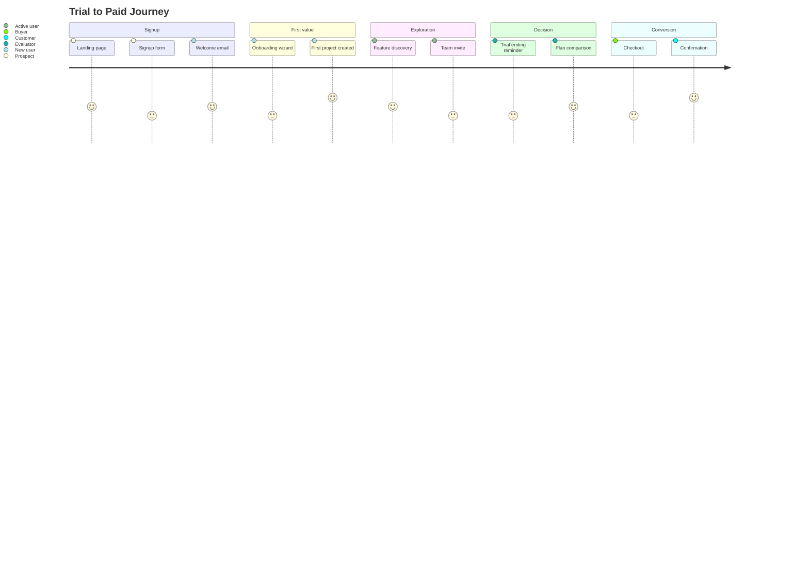

# Examples

## Example 1: SaaS trial-to-paid journey

**Input:**
- Feature: Free trial conversion
- Scope: From trial signup through first paid subscription
- User segment: Small business owners evaluating project management tools

**Output:**

```md
# Journey Content Map: Free Trial to Paid Conversion

## Overview
- **Scope:** Trial signup to first paid subscription
- **User segment:** Small business owners evaluating project management tools
- **Journey type:** Activation + Conversion
- **Total stages:** 5
- **Total touchpoints:** 18

## Journey diagram



## Stage 1: Signup

### Context
- **User goal:** Quickly evaluate if this tool is worth their time
- **Emotional state:** Curious but skeptical; time-pressured
- **Entry trigger:** Clicked "Start free trial" from marketing page
- **Exit criteria:** Account created, logged in to dashboard

### Touchpoints

| Touchpoint | Channel | Content type | Purpose | Owner |
|------------|---------|--------------|---------|-------|
| Trial CTA | Web | Button + microcopy | Persuade | Marketing |
| Signup form | In-app | Form labels, validation messages | Instruct | Product |
| Welcome email | Email | Subject, body, CTA | Orient, build confidence | Lifecycle |

### Content requirements
| Touchpoint | Required content | Tone | Constraints |
|------------|-----------------|------|-------------|
| Trial CTA | Value prop, no-commitment assurance, time frame | Confident, low-pressure | ≤15 words |
| Signup form | Field labels, password requirements, error messages | Clear, minimal | Inline validation |
| Welcome email | Personal greeting, single next step, support access | Warm, action-oriented | ≤150 words body |

### Gap analysis
| Gap identified | Impact | Recommendation |
|----------------|--------|----------------|
| No social proof on signup form | Reduces confidence | Add "Join 10,000+ teams" near submit |
| Welcome email lacks clear single CTA | Dilutes action | Reduce to one "Create your first project" CTA |

---

## Stage 2: First Value

### Context
- **User goal:** Accomplish something meaningful to validate tool choice
- **Emotional state:** Eager but potentially confused; high abandonment risk
- **Entry trigger:** Logged in for first time
- **Exit criteria:** Created first project with at least one task

### Touchpoints

| Touchpoint | Channel | Content type | Purpose | Owner |
|------------|---------|--------------|---------|-------|
| Onboarding wizard | In-app | Headlines, progress steps, skip option | Instruct, guide | Product |
| Empty state | In-app | Illustration, headline, CTA | Motivate first action | Content Design |
| First project template | In-app | Pre-filled content, tooltips | Demonstrate value | Product |
| Day 1 check-in email | Email | Subject, body, help link | Support, encourage | Lifecycle |

### Content requirements
| Touchpoint | Required content | Tone | Constraints |
|------------|-----------------|------|-------------|
| Onboarding wizard | Step count, current step, skip affordance | Friendly, efficient | ≤3 steps visible |
| Empty state | Clear CTA, benefit statement | Encouraging, action-oriented | ≤50 words |
| Day 1 email | Acknowledge signup, one tip, support link | Helpful, not pushy | Send at +24h |

### Gap analysis
| Gap identified | Impact | Recommendation |
|----------------|--------|----------------|
| No in-app help for first task creation | Users abandon at blank task | Add contextual tooltip or sample task |
| Missing "why" for each setup step | Setup feels bureaucratic | Add benefit microcopy per step |

---

## Stage 3: Exploration

### Context
- **User goal:** Discover features that justify switching from current tool
- **Emotional state:** Evaluative; comparing to alternatives
- **Entry trigger:** Completed first project setup
- **Exit criteria:** Used 3+ distinct features or invited team member

### Touchpoints

| Touchpoint | Channel | Content type | Purpose | Owner |
|------------|---------|--------------|---------|-------|
| Feature hints | In-app | Tooltips, coach marks | Educate on capabilities | Product |
| Team invite prompt | In-app | Modal, benefit copy | Expand usage | Growth |
| Feature highlight email | Email | Subject, body, deep link | Surface underused features | Lifecycle |
| Push notification | Mobile | Short message, deep link | Re-engage | Growth |

### Content requirements
| Touchpoint | Required content | Tone | Constraints |
|------------|-----------------|------|-------------|
| Feature hints | Feature name, one-line benefit, "try it" CTA | Helpful, non-intrusive | ≤25 words |
| Team invite | Benefit of collaboration, easy dismiss | Encouraging, not blocking | Show once per session max |
| Feature email | Single feature focus, clear CTA | Informative | Send at Day 3 or Day 5 |

### Gap analysis
| Gap identified | Impact | Recommendation |
|----------------|--------|----------------|
| No comparison to competitor workflows | Users don't see differentiation | Add "Unlike [competitor], you can..." microcopy |
| Team invite prompt lacks social proof | Low conversion | Add "Teams see 40% faster project completion" |

---

## Stage 4: Decision

### Context
- **User goal:** Determine if paid plan is worth the investment
- **Emotional state:** Analytical; weighing cost vs. value
- **Entry trigger:** Trial day 10+ or high engagement signal
- **Exit criteria:** Views pricing page or dismisses upgrade prompt

### Touchpoints

| Touchpoint | Channel | Content type | Purpose | Owner |
|------------|---------|--------------|---------|-------|
| Trial ending banner | In-app | Countdown, upgrade CTA | Create urgency | Growth |
| Trial ending email | Email | Subject, body, plan comparison | Inform, persuade | Lifecycle |
| Plan comparison page | Web/In-app | Feature table, pricing, FAQ | Enable decision | Marketing |
| Personal outreach | Email | Plain-text, offer help | Build relationship | Sales |

### Content requirements
| Touchpoint | Required content | Tone | Constraints |
|------------|-----------------|------|-------------|
| Trial banner | Days remaining, value recap, upgrade CTA | Clear, not alarmist | ≤20 words |
| Trial email | Usage summary, deadline, plan options | Helpful, value-focused | Send at Day 10, 12, 14 |
| Comparison page | Feature list, price per tier, "most popular" flag | Objective, confidence-building | No hidden fees |

### Gap analysis
| Gap identified | Impact | Recommendation |
|----------------|--------|----------------|
| No usage summary in trial-ending email | User can't assess value received | Add "You created X projects with Y tasks" |
| Missing FAQ on pricing page | Unresolved objections | Add top 5 pricing questions |

---

## Stage 5: Conversion

### Context
- **User goal:** Complete purchase quickly and confidently
- **Emotional state:** Committed but sensitive to friction
- **Entry trigger:** Clicked upgrade/subscribe CTA
- **Exit criteria:** Payment successful, access confirmed

### Touchpoints

| Touchpoint | Channel | Content type | Purpose | Owner |
|------------|---------|--------------|---------|-------|
| Checkout form | In-app | Form labels, security assurance | Instruct, reassure | Product |
| Payment confirmation | In-app | Success message, next steps | Confirm, orient | Product |
| Receipt email | Email | Subject, receipt details, support | Document, support | Billing |
| Welcome to paid email | Email | Subject, new features unlocked, resources | Celebrate, activate | Lifecycle |

### Content requirements
| Touchpoint | Required content | Tone | Constraints |
|------------|-----------------|------|-------------|
| Checkout form | Price, billing cycle, security badge, cancel info | Professional, trustworthy | Show total before submit |
| Confirmation | Clear success message, what happens next | Celebratory, helpful | No upsell on this screen |
| Welcome email | New capabilities, how to get help | Warm, appreciative | Send within 1 hour |

### Gap analysis
| Gap identified | Impact | Recommendation |
|----------------|--------|----------------|
| No mention of cancellation policy in checkout | Creates hesitation | Add "Cancel anytime" near submit |
| Welcome email doesn't highlight paid-only features | User doesn't perceive upgrade value | Add "Now unlocked:" section |

---

## Cross-stage analysis

### Content dependencies
| Source stage | Source touchpoint | Target stage | Dependency type |
|--------------|-------------------|--------------|-----------------|
| Signup | Welcome email | First Value | Sets expectation for onboarding |
| First Value | Project creation | Exploration | Unlocks feature hints |
| Exploration | Usage data | Decision | Enables personalized trial-ending email |
| Decision | Plan selection | Conversion | Determines checkout flow |

### Handoff risks
| Handoff | Risk | Mitigation |
|---------|------|------------|
| Signup → First Value | User closes welcome email, forgets to return | In-app empty state must stand alone |
| Exploration → Decision | User hasn't found enough value | Feature email should highlight unused capabilities |
| Decision → Conversion | Sticker shock at checkout | Show pricing earlier in decision stage |

## Content gap summary
| Stage | Gap count | Severity | Priority |
|-------|-----------|----------|----------|
| Signup | 2 | Medium | P1 |
| First Value | 2 | High | P0 |
| Exploration | 2 | Medium | P1 |
| Decision | 2 | High | P0 |
| Conversion | 2 | Medium | P1 |

## Validation checklist
- [x] All journey stages have at least one touchpoint
- [x] User goal documented for each stage
- [x] Emotional state identified per stage
- [x] Content gaps explicitly identified
- [x] Cross-channel touchpoints included
- [x] Dependencies between stages documented
```

---

## Example 2: Edge case — non-linear recovery journey

**Input:**
- Feature: Password reset
- Scope: From "forgot password" to successful login with new password
- User segment: All users (frustrated, locked out)

**Output:**

```md
# Journey Content Map: Password Reset Recovery

## Overview
- **Scope:** Forgot password trigger to successful re-authentication
- **User segment:** All users (any user who can't access their account)
- **Journey type:** Recovery (non-linear with potential loops)
- **Total stages:** 4
- **Total touchpoints:** 12

## Journey structure note
This journey is non-linear. Users may:
- Loop between "Request" and "Check email" if they don't receive the email
- Branch from "Reset" to "Error" and back
- Exit early if they remember their password

## Stage 1: Request

### Context
- **User goal:** Initiate password recovery as fast as possible
- **Emotional state:** Frustrated, possibly anxious about account security
- **Entry trigger:** Clicked "Forgot password" link
- **Exit criteria:** Email submitted, confirmation shown

### Touchpoints

| Touchpoint | Channel | Content type | Purpose | Owner |
|------------|---------|--------------|---------|-------|
| Forgot password link | In-app | Link text | Enable recovery | Product |
| Email input form | In-app | Label, placeholder, error messages | Instruct | Product |
| Submission confirmation | In-app | Headline, body | Reassure, instruct next step | Product |

### Content requirements
| Touchpoint | Required content | Tone | Constraints |
|------------|-----------------|------|-------------|
| Email form | Clear label, format hint, "email not found" handling | Calm, efficient | No reveal if email exists (security) |
| Confirmation | "Check your email" instruction, spam folder note, retry option | Reassuring | Don't confirm email existence |

### Gap analysis
| Gap identified | Impact | Recommendation |
|----------------|--------|----------------|
| No estimated delivery time | User doesn't know how long to wait | Add "Usually arrives within 2 minutes" |
| Missing "didn't get it?" link on confirmation | User has no recourse | Add retry option after 60 seconds |

---

## Stage 2: Check email (loop potential)

### Context
- **User goal:** Find and access the reset email quickly
- **Emotional state:** Impatient, checking multiple folders
- **Entry trigger:** Sees confirmation message
- **Exit criteria:** Clicks reset link in email

**Loop condition:** If email not found after 2+ minutes, user may return to Request stage.

### Touchpoints

| Touchpoint | Channel | Content type | Purpose | Owner |
|------------|---------|--------------|---------|-------|
| Reset email | Email | Subject, body, CTA button, expiration notice | Enable action | Product |
| Email not received page | In-app | Troubleshooting steps, retry CTA | Support, unblock | Product |

### Content requirements
| Touchpoint | Required content | Tone | Constraints |
|------------|-----------------|------|-------------|
| Reset email | Clear subject, single CTA, link expiration time, security note | Direct, trustworthy | Link valid 24h, subject ≤50 chars |
| Not received page | Check spam, check email address, retry option, support link | Helpful, patient | Show after 60 seconds |

### Gap analysis
| Gap identified | Impact | Recommendation |
|----------------|--------|----------------|
| Reset email subject doesn't include product name | Lost in inbox | Use "[Product] Reset your password" format |
| No plain-text fallback in email | HTML rendering issues cause failure | Include plain-text version |

---

## Stage 3: Reset

### Context
- **User goal:** Create new password and regain access immediately
- **Emotional state:** Relieved (found email), focused on completion
- **Entry trigger:** Clicked reset link in email
- **Exit criteria:** New password saved, redirected to login or dashboard

**Branch condition:** If link expired or invalid, branch to Error stage.

### Touchpoints

| Touchpoint | Channel | Content type | Purpose | Owner |
|------------|---------|--------------|---------|-------|
| New password form | In-app | Labels, requirements, validation | Instruct | Product |
| Password strength indicator | In-app | Visual + text feedback | Guide | Product |
| Success confirmation | In-app | Headline, auto-login or login CTA | Confirm, enable next action | Product |

### Content requirements
| Touchpoint | Required content | Tone | Constraints |
|------------|-----------------|------|-------------|
| Password form | Requirements listed upfront, real-time validation | Clear, supportive | Min 8 chars, show/hide toggle |
| Success | Explicit confirmation, immediate next step | Congratulatory, efficient | Auto-login preferred |

### Gap analysis
| Gap identified | Impact | Recommendation |
|----------------|--------|----------------|
| Password requirements only shown on error | User fails first attempt | Show requirements before input |
| No "remember me" option after reset | User has to re-authenticate soon | Offer to stay signed in |

---

## Stage 4: Error (branch)

### Context
- **User goal:** Understand what went wrong and get unstuck
- **Emotional state:** Frustrated, potentially suspicious of phishing
- **Entry trigger:** Reset link expired, invalid, or already used
- **Exit criteria:** User requests new link or contacts support

### Touchpoints

| Touchpoint | Channel | Content type | Purpose | Owner |
|------------|---------|--------------|---------|-------|
| Link expired page | In-app | Headline, explanation, retry CTA | Explain, enable recovery | Product |
| Link invalid page | In-app | Headline, explanation, support CTA | Explain, provide recourse | Product |

### Content requirements
| Touchpoint | Required content | Tone | Constraints |
|------------|-----------------|------|-------------|
| Expired page | Clear explanation, single CTA to request new link | Calm, solution-focused | No blame |
| Invalid page | Security-conscious explanation, support option | Reassuring, careful | Don't reveal if link was valid before |

### Gap analysis
| Gap identified | Impact | Recommendation |
|----------------|--------|----------------|
| Same message for expired vs. already-used | User doesn't know what happened | Differentiate: "This link has expired" vs. "This link was already used" |

---

## Cross-stage analysis

### Content dependencies
| Source stage | Source touchpoint | Target stage | Dependency type |
|--------------|-------------------|--------------|-----------------|
| Request | Confirmation | Check email | Sets expectation for email arrival |
| Check email | Reset email | Reset | Contains reset link |
| Reset | Success | (Exit) | May include session token |
| Error | Retry CTA | Request | Loops back to start |

### Handoff risks
| Handoff | Risk | Mitigation |
|---------|------|------------|
| Request → Check email | Email goes to spam | Include spam folder note in confirmation |
| Check email → Reset | Link expires before user finds email | 24h expiration (not 1h) |
| Reset → Error (branch) | Link already used but user bookmarked | Clear messaging that link is single-use |

## Content gap summary
| Stage | Gap count | Severity | Priority |
|-------|-----------|----------|----------|
| Request | 2 | Medium | P1 |
| Check email | 2 | High | P0 |
| Reset | 2 | Medium | P1 |
| Error | 1 | Low | P2 |

## Validation checklist
- [x] All journey stages have at least one touchpoint
- [x] User goal documented for each stage
- [x] Emotional state identified per stage
- [x] Content gaps explicitly identified
- [x] Cross-channel touchpoints included
- [x] Dependencies between stages documented
```
