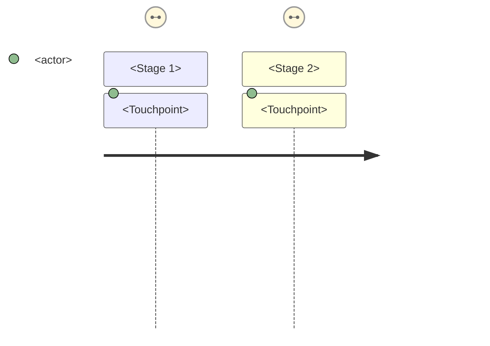

# Templates

## Default output: Journey content map

```md
# Journey Content Map: <Feature/Product Name>

## Overview
- **Scope:** <full lifecycle / specific phase>
- **User segment:** <target audience>
- **Journey type:** <acquisition / activation / engagement / retention / expansion>
- **Total stages:** <count>
- **Total touchpoints:** <count>

## Journey diagram



## Stage 1: <Stage Name>

### Context
- **User goal:** <what user is trying to accomplish>
- **Emotional state:** <confident / uncertain / frustrated / curious / etc.>
- **Entry trigger:** <what brings user to this stage>
- **Exit criteria:** <what marks completion of this stage>

### Touchpoints

| Touchpoint | Channel | Content type | Purpose | Owner |
|------------|---------|--------------|---------|-------|
| <name> | <in-app / email / push / web / etc.> | <headline / body / CTA / form / etc.> | <inform / persuade / instruct / reassure> | <team> |

### Content requirements
| Touchpoint | Required content | Tone | Constraints |
|------------|-----------------|------|-------------|
| <name> | <specific content elements> | <tone range> | <char limits, legal, etc.> |

### Gap analysis
| Gap identified | Impact | Recommendation |
|----------------|--------|----------------|
| <missing content> | <user impact> | <proposed solution> |

---

## Stage 2: <Stage Name>
<repeat structure>

---

## Cross-stage analysis

### Content dependencies
| Source stage | Source touchpoint | Target stage | Dependency type |
|--------------|-------------------|--------------|-----------------|
| <stage> | <touchpoint> | <stage> | <data / context / action> |

### Handoff risks
| Handoff | Risk | Mitigation |
|---------|------|------------|
| <stage A → stage B> | <what could go wrong> | <how to prevent> |

## Content gap summary
| Stage | Gap count | Severity | Priority |
|-------|-----------|----------|----------|
| <stage> | <count> | <high / medium / low> | <P0 / P1 / P2> |

## Validation checklist
- [ ] All journey stages have at least one touchpoint
- [ ] User goal documented for each stage
- [ ] Emotional state identified per stage
- [ ] Content gaps explicitly identified
- [ ] Cross-channel touchpoints included
- [ ] Dependencies between stages documented
```

## Compact touchpoint matrix (for quick reference)

```md
# Touchpoint Matrix: <Feature Name>

| Stage | In-app | Email | Push | Web | SMS |
|-------|--------|-------|------|-----|-----|
| <stage 1> | <touchpoint list> | <touchpoint list> | — | — | — |
| <stage 2> | <touchpoint list> | — | <touchpoint list> | — | — |

Legend: — = no touchpoint in this channel
```

## Journey audit format (for existing products)

```md
# Journey Content Audit: <Feature Name>

## Audit scope
- **Date:** <YYYY-MM-DD>
- **Auditor:** <name>
- **Coverage:** <what was reviewed>

## Findings by stage

### <Stage Name>
| Touchpoint | Current state | Issue | Severity | Recommendation |
|------------|---------------|-------|----------|----------------|
| <name> | <description> | <problem> | <H/M/L> | <fix> |

## Summary
- **Total touchpoints audited:** <count>
- **Issues found:** <count>
- **Critical gaps:** <count>
```
