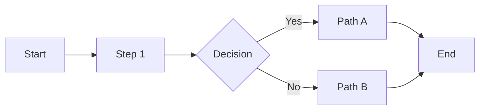
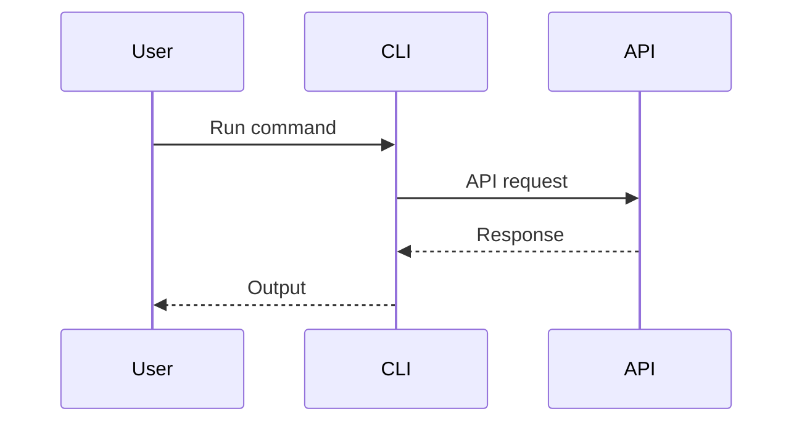
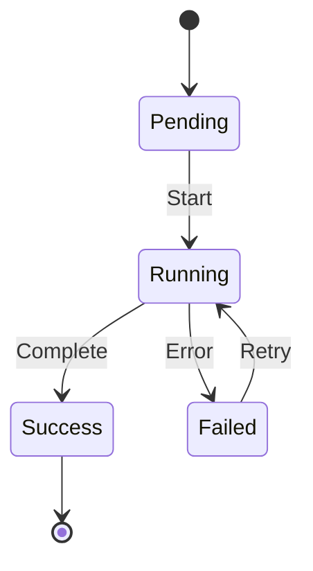

# Diagram Conventions Reference

## Table of contents
1. [When to include diagrams](#when-to-include-diagrams)
2. [ASCII diagram conventions](#ascii-diagram-conventions)
3. [Mermaid diagram conventions](#mermaid-diagram-conventions)
4. [Common workflow shapes](#common-workflow-shapes)

---

## When to include diagrams

### Include a diagram when:
- Workflow has 4+ steps
- Workflow has decision points or branches
- Multiple systems or tools interact
- Parallel execution occurs
- Readers need to understand flow before diving into details

### Skip diagrams when:
- Workflow is linear with 3 or fewer steps
- Text description is clearer than visual
- Diagram would just repeat step headings

---

## ASCII diagram conventions

ASCII diagrams work everywhere and require no rendering.

### Basic flow
```
[Step 1] → [Step 2] → [Step 3]
```

### Branching
```
[Step 1] → [Decision]
              ├→ [Path A] → [End]
              └→ [Path B] → [End]
```

Or with explicit join:
```
         ┌→ [Path A] →┐
[Start] ─┤            ├→ [End]
         └→ [Path B] →┘
```

### Parallel execution
```
         ┌→ [Job A] →┐
[Start] ─┼→ [Job B] →┼→ [Join] → [End]
         └→ [Job C] →┘
```

### Loop/retry
```
[Start] → [Do Work] → [Check] → [Done]
              ↑          │
              └──────────┘
```

### System interaction
```
┌─────────────┐     ┌─────────────┐
│   Client    │ ──► │   Server    │
└─────────────┘     └─────────────┘
       ▲                   │
       └───────────────────┘
```

### Character reference
| Character | Usage |
|-----------|-------|
| `→` or `->` | Flow direction |
| `↓` `↑` `←` `↘` `↗` | Multi-direction arrows |
| `│` `─` | Lines |
| `┌` `┐` `└` `┘` | Corners |
| `├` `┤` `┬` `┴` `┼` | Junctions |
| `[ ]` | Process/step |
| `< >` | Decision (optional, often use [ ] ) |
| `( )` | Start/end (optional) |

---

## Mermaid diagram conventions

Use Mermaid when rendering is available (GitHub, many doc platforms).

### Flowchart


### Sequence diagram (for tool interactions)


### State diagram (for workflows with states)


### Style guidelines for Mermaid
- Use `LR` (left-right) for linear workflows
- Use `TB` (top-bottom) for hierarchical workflows
- Keep node text short (1-3 words)
- Use decision diamonds `{ }` for branch points
- Label edges when meaning isn't obvious

---

## Common workflow shapes

### CI/CD pipeline (horizontal)
```
┌─────────┐   ┌─────────┐   ┌─────────┐   ┌─────────┐
│  Test   │ → │  Build  │ → │  Deploy │ → │ Verify  │
└─────────┘   └─────────┘   └─────────┘   └─────────┘
```

### Approval workflow (vertical with gates)
```
     [Submit]
         │
         ▼
    [Review 1]
         │
    ┌────┴────┐
    ▼         ▼
[Approve] [Reject]
    │         │
    ▼         │
[Review 2]    │
    │         │
    ▼         │
[Deploy] ◄────┘ (back to Submit)
```

### Error handling (with recovery path)
```
[Start] → [Action] → [Check]
              │          │
              │     ┌────┴────┐
              │     ▼         ▼
              │ [Success]  [Error]
              │     │         │
              │     │    [Recover]
              │     │         │
              │     │    ┌────┴────┐
              │     │    ▼         ▼
              │     │ [Fixed]  [Abort]
              │     │    │
              └─────┴────┘
                    │
                    ▼
                 [Done]
```

### Multi-environment deployment
```
                    ┌─────────────┐
                    │   Build     │
                    └──────┬──────┘
                           │
              ┌────────────┼────────────┐
              ▼            ▼            ▼
        ┌─────────┐  ┌─────────┐  ┌─────────┐
        │   Dev   │  │ Staging │  │  Prod   │
        └─────────┘  └─────────┘  └─────────┘
              │            │            │
              ▼            ▼            ▼
        [Auto-test] [Manual QA]  [Canary %]
```
